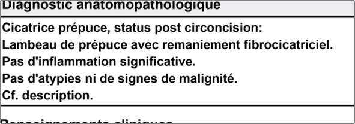
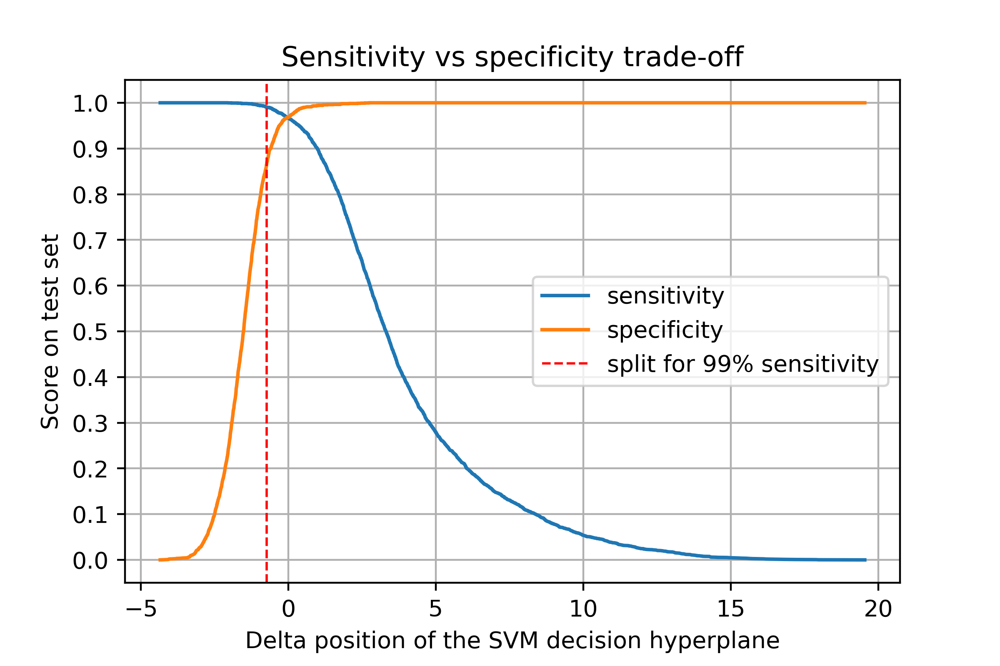

# Automatic Tumor Detection
This project describes from start to finish a machine learning project that was done during my work at the Lausanne University Hospital (Unisanté) to classify cancer-related lab reports. The company gracefully accepted that I published it here.

**Table of Contents:**

[Project report](#Project-report) - The full description of the project goals, dataset and results.<br>
[Installation](#Installation) - How to install and run the project.<br>
[Code overview](#Code-overview) - A brief overview of the code.


## Project report
### Introduction
The Vaud Tumor Registry receives about 100K pathology reports every year, but only a fraction of those are interesting to the registry. The “interesting” reports (patient affected with a malign tumor) are processed by a specialist and registered in a database, whereas the negative reports (benign tumor or no tumor) are discarded.

The goal of this project is to use machine learning to do binary classification on the pathology documents to automatically detect if a report is positive (“interesting”) or negative. Machine learning must be used to solve this task because pathology reports consist in a free-text written by a doctor. So, there is no specific text or element, in a specific position in all documents that would always say “no tumor” or “found tumor” (which could have allowed to solve this task without machine learning).


|  | |
:-------------------------:|:-------------------------:
  |  
Part of a positive text (in French). You can recognize some tumor positive related words, such as "adénocarcinome" (adenocarcinoma) or "métastase" (metastasis). | Part of a negative text (in French). You can observe a negative statement about tumor detection: "Pas [...] de signes de malignité" (no indication of malignant tumor)

### Datasets
The data consists in PDF documents coming from multiple laboratories (usually situated in the French speaking part of Switzerland). A dataset of 25.000 positive and 16.000 negative documents was manually labeled in order to use supervised learning. The dataset was split so that 85% of these documents were used as a training set and the remaining 15% as a primary test set. Another small dataset from previous work was used as a secondary test set.

### Metrics
In this task, note that a false-positive document is not as “bad” as a false-negative one, as all the documents classified as positive are manually reviewed later (a mistake costs time), which is not the case for the negative ones (a mistake loses the document forever). Therefore, two metrics are used. The main one to optimize is recall (also called sensitivity) because it is not acceptable for the registry to lose too many positive tumor reports. The secondary metric that to optimize is specificity because it remains important to make as few mistakes as possible when classifying a document as positive.

### Preprocessing and model selection
This task was programmed in Python. As a preprocessing step, the spacy library allowed to clean and tokenize the text. The scikit-learn library was used for the machine learning part.

It was decided to use models that yield “understandable results”, which means that for each data point it should be possible to understand why the model has classified it as positive or negative. In regard to this constraint, it was decided to use “classical models” and avoid neural networks (which can have better results but are harder to understand). 

After some initial tests, the most promising models were random forest and SVM, using either a matrix of token occurrences (bag-of-words) or TF-IDF features. The hyper-parameters of both the feature generation and the models were tuned together using grid-search and tested with 4-folds cross-validation on the training set to find the best possible model.

### Best model description
The best model was SVM with the following parameters:
-    Token occurrences (sklearn CountVectorizer): unigram, binary feature, vocabulary consisting of the top 5000 words (ordered by term frequency across the corpus).
-    Linear SVM: squared hinged loss and C parameter of 0.1.
Furthermore, the SVM decision hyperplane was manually “moved” in a perpendicular direction which allowed to make some trade-offs between the recall and the specificity. In the end, moving the hyperplane of -0.724 allowed to improve the recall so that it reaches the project’s objectives while lowering the specificity to a level that remained acceptable. You can observe the trade-offs between the sensitivity (recall) and specificity on the figure below.


*Sensitivity vs specificity trade-off and hyperplan decision*

### Previous classification system: keyword-based model
Before this project, the Tumor Vaud Registry team used a keyword-based classification algorithm. They had manually examined many documents and had come up with a list of 155 keywords usually found in positive documents. Then, they devised a simple classification algorithm which, given a document, tried to find any of the 155 keywords in it. If any keyword was found, the document was classified as positive, and if none were found, the document was classified as negative. Though simple, this algorithm yielded good results, and had proven to be robust. The proposed model will be compared with this algorithm called here the “keyword model”.

### Results
The result of the model on both test sets were as follow:

<table>
  <tr>
    <th></th>
    <th colspan="2">Keyword Model</th>
    <th colspan="2">SVM</th>
  </tr>
  <tr>
    <td></td>
    <td>Recall</td>
    <td>Specificity</td>
    <td>Recall</td>
    <td>Specificity</td>
  </tr>
  <tr>
    <td>Primary test set</td>
    <td>0.98</td>
    <td>0.86</td>
    <td>0.99</td>
    <td>0.87</td>
  </tr>
  <tr>
    <td>Secondary test set</td>
    <td>0.95</td>
    <td>0.85</td>
    <td>0.99</td>
    <td>0.75</td>
  </tr>
</table>

Even though the keyword model performed at an acceptable level, SVM outperformed it on the main metric (recall). An excellent recall and a high specificity can be observed for the SVM model on both datasets. A difference in specificity between the primary and secondary datasets can be observed. This difference is probably due to the way the datasets were created (the reports were handpicked for one, and automatically collected for the other which means they don’t come from the same distribution).

### Conclusion and further work
Overall, these results are great and allow the project to move forward in automating this classification task.

Here are a few ideas to continue this work:
-	Preprocessing/cleaning: Refining this step would remove some of the noise left in the data and therefore help the model to better learn (for example, deleting document headers, improving proper noun removal, etc.).
-	Customizing the loss function. The recall/specificity requirements could be directly specified in the loss function, which could be done using machine learning framework such as TensorFlow that allows to optimize custom loss function.
-	Neural network models: Given that classical models yielded great results, recent models such as using word embeddings + CNN/RNN would be the next logical step. With enough data and trained correctly, the more complex functions of these models would certainly improve the classification (at the cost of losing some understanding of the results).

## Installation
Java 7+ is needed for the package tika-python (which reads PDF files), so it needs to be installed first.

The file `environment.yml` contains the conda environment that needs to be installed to execute the code on the repo:


```
    >> conda env create -f environment.yml
    >> activate tum
    >> python -m spacy download fr_core_news_sm
```

## Code overview
`src/models/` contains the SVM and keyword model definition.
`src/preprocessing` contains the code to preprocess the different datasets.
`src/utils` contains some utility functions.

The jupyter notebook `train_svm_classifier.ipynb` can be used to train the SVM classifier.
The jupyter notebook `classification_and_results_for_all_models.ipynb` contains the results for both models on the primary and secondary datasets.
